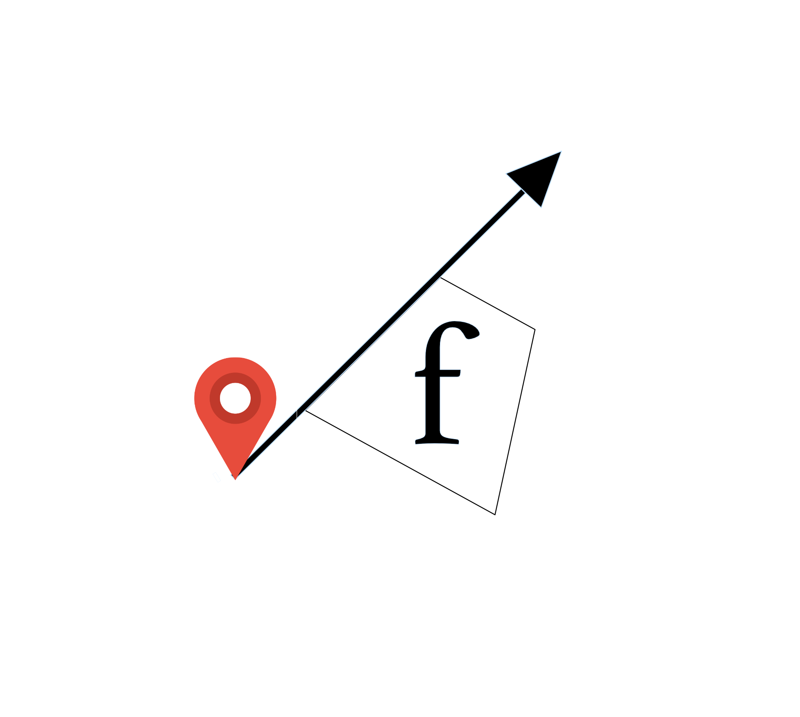
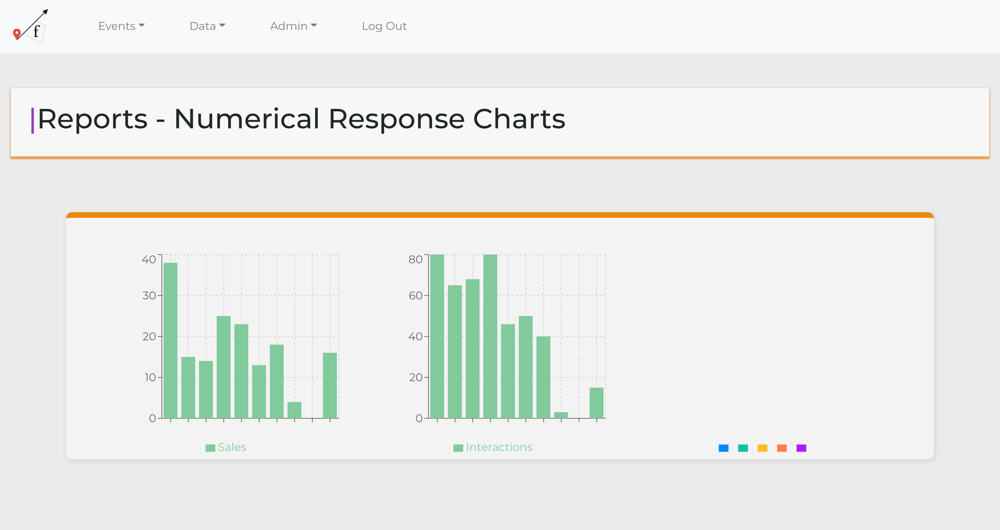
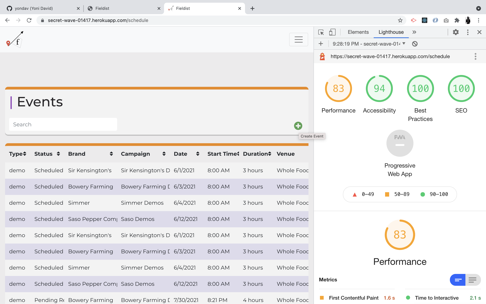

# Fieldist/ fieldist

[](https://opensource.org/licenses/MIT)

<div align="center">
  <div>
    <a href="https://github.com/tomekregulski/fieldist" alt"repo">
      
      <p align=left>&nbsp;&nbsp;Repo</p>
    </a>
  </div>
  <a href="https://secret-wave-01417.herokuapp.com/schedule" alt"deployed">
    
  </a>
</div>
<br />

<br />

## About / Synopsis

<br />
<div align="center">
<p>
  THIS REPO IS DEPRACATED.

This project has been split up into separate apps and is being integrated into a larger porject called Intelly.

The individual projects can be accessed below:
Field Reporting - Front End: https://github.com/tomekregulski/fieldist-rep-web-client
Field Events - Back End: https://github.com/tomekregulski/fieldist-back-end
Field Events Administration - Front End: https://github.com/tomekregulski/fieldist-admin-web-client

</p>
<p>
  Fieldist is a platform built using Node.js, React, MySQL, and Express; and designed for agencies to manage their field marketing business. At the core of the app is a multi-role authentication program that conditionally renders the app based on the role of the user (admin, brand contact, and field rep).

A field rep can view their specific work schedule, check in and out at a location, and submit a report. They can edit that report until it is approved by an admin.

A brand contact is able to view the schedules and data (raw data table and metric charts) for events assigned to their brand, as well as completed reports once they have been approved by an admin.

Admins have the most access in the app. In regard to event reports – they can approve or deny a report, add comments to support their decision, and ultimately give a rating to the report, which can be used for internal revue purposes. Additionally, they can view the full schedule of events (past, present, and future) and full spread of report data (raw data tables and metric charts). Finally, admins have full CRUD capabilities for all models in the database.

This app is a prototype with plans for future development. It is deployed and kept up to date <a href="https://secret-wave-01417.herokuapp.com/">here</a>.

</p>
</div>
<br />

---

<br />

## Table of Contents

<br/>

> - [Title / Repository Name](#title--repository-name)
>   - [About / Synopsis](#about--synopsis)
>   - [Table of Contents](#table-of-contents)
>   - [Installation](#installation)
>   - [Usage](#usage)
>     - [Active Accounts](#active-accounts)
>   - [Demo](#demo)
>   - [Author](#author)
>     - [Contact](#contact)
>   - [Contributing / Issues](#contributing--issues)
>     - [Contributing](#contributing)
>     - [Reporting Issues](#reporting-issues)
>   - [License](#licenses)

<br />

---

<br />

## Installation

<br />

To install and run this app locally, you must first ensure that you have current versions of Node.js and MySQL Workbench installed on your machine.

Then, clone the repository and open it in the code editor of your choice. From the root directory, run

<br />

```
npm i
```

<br />

in your terminal to install all necessary front- and back-end dependencies.

Once this is done, you need to set up a .env file in the root directory. This does a Cloudinary account, so please set up a free one if you do not have one already. Please follow the format below to ensure your .env file is set up correctly:

<br />

```
DB_NAME=
DB_USER=
DB_PW=
SERVER_PORT=
SECRET=
```

<br />

Additionally, go into client/package.json and update the ‘Proxy” to match your server port.

Once this is all complete, you can start the app by running

<br />

```
npm start
```

<br />

---

<br />

## Usage

<br />

When you first load up the app, you will be brought to a Login page. No other page is accessible to the public. You can use the credentials below to log in as any of the user types.

<br />

### Active Accounts

<br />

> - admin@fieldist.com / admin
> - contact1@fieldist.com / contact
> - rep1@fieldist.com / rep1
> - rep2@fieldist.com / rep2
> - contact1@fieldist.com / contact
> - contact2@fieldist.com / contact
> - contact3@fieldist.com / contact
> - contact4@fieldist.com / contact

<br />

---

<br />

## Demo

<br />

<div align="center">
  
  
  
</div>

<br />

<div align="center">
  
  
</div>

<br/>

---

<br />

## Contributors

<br />

<div>
  <div>
    <div align="left">
      
      <h3 style="2rem">Tomek Regulski</h3>
      <div>
        <a href="https://github.com/tomekregulski">
               
        </a>
        <a href="https://tomekregulski.github.io/portfolio/">
           
        </a>
        <br />
        <br />
      </div>
    </div>
    <div align="left">
      
      <h3 style="2rem">Yoni David</h3>
      <div>
        <a href="https://github.com/yondav">
               
        </a>
        <a href="https://www.yondav.us/">
           
        </a>    
      </div>
    </div>
  </div>
</div>

<br />

---

<br />

## Contributing / Issues

<br />

### Contributing

<br />

You are welcome to fork the repo and make pull requests for any features that you think would support and expect

<br />

---

<br />

## Licenses

<br />

- [MIT](https://github.com/yondav/13-e-commerce-back-end/blob/main/LICENSE)

<br />

---

<br />

<div align="center">
  
  
  
  
  
  
  <p>This README file was built with 
    <a href="https://github.com/yondav/README-gen-09">README GENERATOR</a>
  </p>
  <p>Copyright &copy; 2021, Fieldist<p>
</div>
